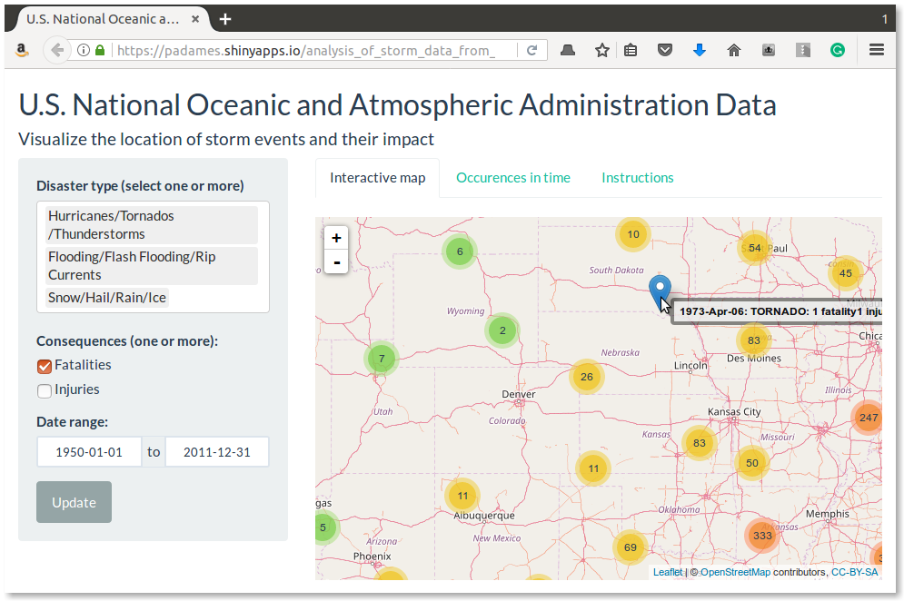
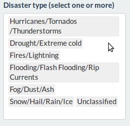
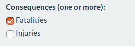
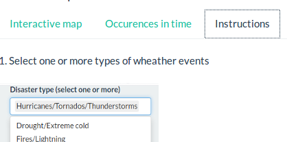

Why an Interactive User Interface to analyze the storm data
========================================================
author: Pablo Adames
date: April 2, 2017
autosize: true

The App Vs. The Data
========================================================



[<https://padames.shinyapps.io/analysis_of_storm_data_from_naoo_data/>](https://padames.shinyapps.io/analysis_of_storm_data_from_naoo_data/)


```
       STATE    EVTYPE FATALITIES INJURIES LATITUDE LONGITUDE
55        AL      HAIL          0        0     3435      8700
1456      AL HIGH WIND          0        0     3203      8613
210826    MN LIGHTNING          0        0        0         0
                                EVT_TYPE                DATE
55                    Snow/Hail/Rain/Ice 1955-04-03 00:25:00
1456   Hurricanes/Tornados/Thunderstorms 1975-04-01 00:10:00
210826                   Fires/Lightning 1994-04-06 00:16:00
```

The Data
========================================================

* 902297 entries in the data set 
* Spanning 5 decades
* Same seven categories for the storm events (as in previous work)



* Two types of effects on population



* Instructions in the App 




Geolocating events and documenting the effects
========================================================

One of the barriers to making sense of the data 
is understanding where and how often it happens.

R plus the Leaflet library and shiny offer a powerful visualization tool
for complex data sets

![Effects aglomerated at low zoom][fig1]  ![Distinguishable effects at high zoom][fig2]


The effects can be seen in detail at the higher zoom levels (right image).


Insight into the data
========================================================

It is easy to get distracted or fail to identify the trends in complex ata sets.

This data set is one such complex set but thanks to this App it can be explored
to identify those features of the data that oftentimes remain hidden under the shear volume
of the information.

Visit
[<https://padames.shinyapps.io/analysis_of_storm_data_from_naoo_data/>](https://padames.shinyapps.io/analysis_of_storm_data_from_naoo_data/)

To download orignal data visit:
[ftp://ftp.ncdc.noaa.gov/pub/data/swdi/stormevents/csvfiles/>](ftp://ftp.ncdc.noaa.gov/pub/data/swdi/stormevents/csvfiles/).

The format changed in 2014 making the data easier to understand and to process.
However it's still quite challenging to explore  whitout an app.

[fig1]: images/pitch4.png "Effects aglomerated at low zoom"
[fig2]: images/pitch6.png "Distinguishable effects at high zoom"
