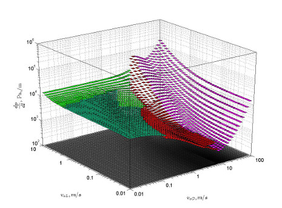
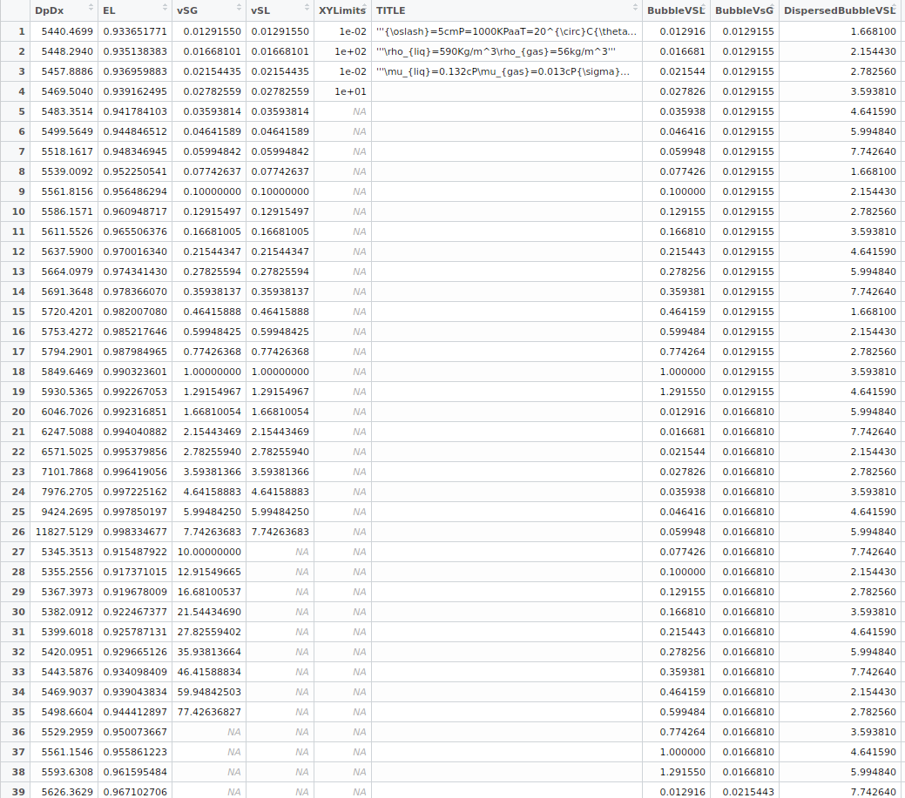

```{r setup, include=FALSE}
knitr::opts_chunk$set(echo = FALSE)
```

## The goal

The goal of this presentation is to show how to transform a data set used to create
a 3-D scatter plot presented in a Master of Science thesis from flow simulation data
into a similar plot but using Plotly from **R**.

This is an assignment for the course **Developing Data Products** taught by Brian Caffo from the 
from the John Hopkins University School of Public Health through Coursera.

## The original plot

Here is the graph to be reproduced in Plotly.



## The data

The original data set for the plot was generated through simulation
using a compiled program written in C++ and the Matlab engine.
The data was stored as a Matlab *.mat* workspace file.

The transformation into a csv was done in a spreadsheet giving 
file *TestDataForPlotly4.csv*.



## Transforming the csv data for plotting

```{r transforming, echo = TRUE}
df4 <- read.csv("TestDataForPlotly4.csv")
vsl<-df4$vSL[!is.na(df4$vSL)]
vsg<-df4$vSG[!is.na(df4$vSG)]
VSL <- do.call( c, replicate(length(vsg),as.list(vsl)))
# a list of 35 vectors of 26 values (910 in total)
listOfVsgs<-lapply(vsg,function(x) replicate(26,x))	
VSG<-Reduce(f="c",listOfVsgs)
c(length(vsl),length(vsg),length(VSL),length(VSG))
# Some tests:
c(all(tail(VSL, n=26)==vsl),all(tail(VSG, n=26)==replicate(26,vsg[35])))
```

## The new data frame for the scatter plot

```{r dataFramePlot, echo = TRUE}
responses <-data.frame(VSG=VSG, VSL=VSL, DPDX=df4$DpDx, EL=df4$EL)
head(responses,n=2)
tail(responses,n=2)
```

## The code for the plot

```{r plotlydpdxCode, echo=TRUE,eval=FALSE}
library(plotly)
plot_ly(responses,
         x= ~VSG, 
         y= ~VSL, 
         z= ~DPDX,
         size = I(2),
         type = "scatter3d",
         color = ~DPDX) %>%
     layout(title="Pressure gradient, dp/dl in Pa/m",
            scene=list(xaxis=list(title="Vsg, m/s",type = "log"),
                       yaxis=list(title="Vsl, m/s",type="log"),
                       zaxis=list(title="dp/dl",type="log"),
                       camera = list(eye = list(x = -1.6, 
                                                y = -1.9, 
                                                z = 0.6))))
```

## The plot

```{r plotlydpdx, echo=FALSE, message=FALSE,warning=FALSE,fig.align='left',out.height=500,out.width=800}
library(plotly)
plot_ly(responses,
         x= ~VSG, 
         y= ~VSL, 
         z= ~DPDX,
         size = I(2),
         type = "scatter3d",
         color = ~DPDX) %>%
     layout(title="Pressure gradient, dp/dl in Pa/m",
            scene=list(xaxis=list(title="Vsg, m/s", type = "log"),
                       yaxis=list(title="Vsl, m/s", type= "log"),
                       zaxis=list(title="dp/dl", type= "log"),
                       camera = list(eye = list(x = -1.6, 
                                                y = -1.9, 
                                                z = 0.6))))
```

